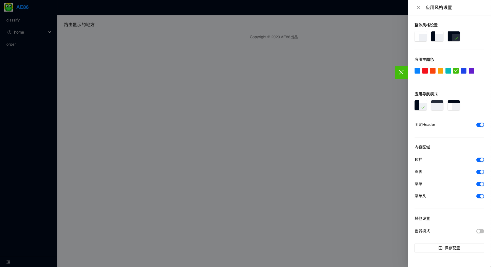

# @x.render/render-react-admin-layout

#### 介绍

render 中后台项目 layout 组件

#### 安装教程

```javascript
npm i @x.render/render-react-admin-layout -S
```

#### 使用说明

```javascript
import { MenuProps } from "antd";
import Layout from "@x.render/render-react-admin-layout";
import AppUser from "./AppUser";
import menuItems from "./AppMenu";
import LogoImg from "./logo.png";
import "@x.render/render-react-admin-layout/dist/index.css";

const AppLayout = () => {
  // menu点击的回调函数
  const handleMenuClick: MenuProps["onClick"] = (menuInfo) => {
    console.log(menuInfo);
  };

  return (
    <Layout
      logoUrl={LogoImg}
      title="render"
      renderMenu={AppUser}
      menuItems={menuItems}
      menuItemClick={handleMenuClick}
    >
      container显示区域
    </Layout>
  );
};
export default AppLayout;
```

#### 配置项

| 选项          | 说明                                                                                                                            | 类型                 | 默认值    |
| :------------ | :------------------------------------------------------------------------------------------------------------------------------ | :------------------- | --------- |
| logoUrl       | 显示的网页 logo                                                                                                                 | string               | null      |
| title         | 显示的 title 值                                                                                                                 | string               | ae86      |
| renderMenu    | 右上角用户信息展示                                                                                                              | JSX.Element          | undefined |
| menuItems     | 左侧和 header 区域显示的菜单，[参考 antd 中的 Menu 导航菜单里面 items 配置](https://ant-design.antgroup.com/components/menu-cn) | ItmeType[]           | []        |
| menuItemClick | 菜单点击的回调函数                                                                                                              | MenuProps["onClick"] | undefined |

#### layout 组件显示效果


